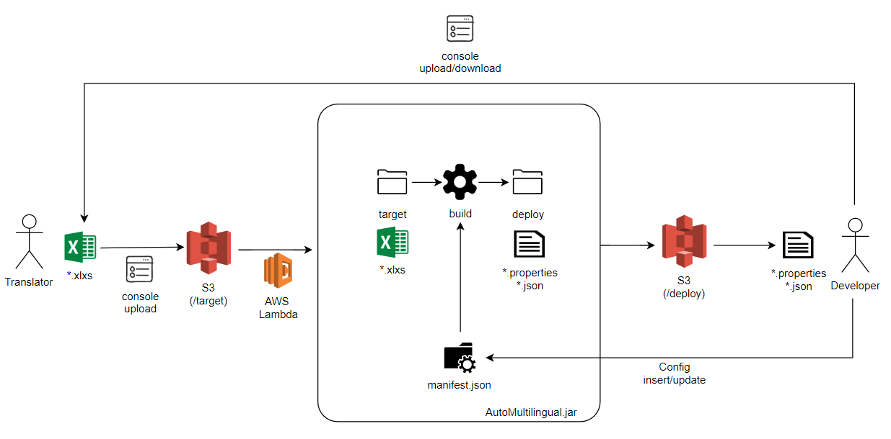
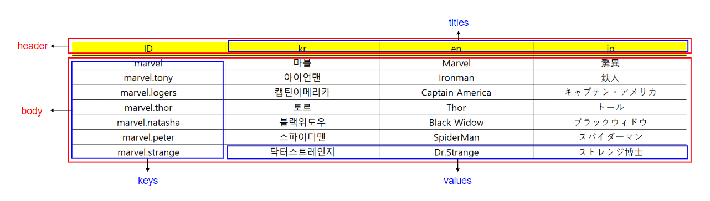
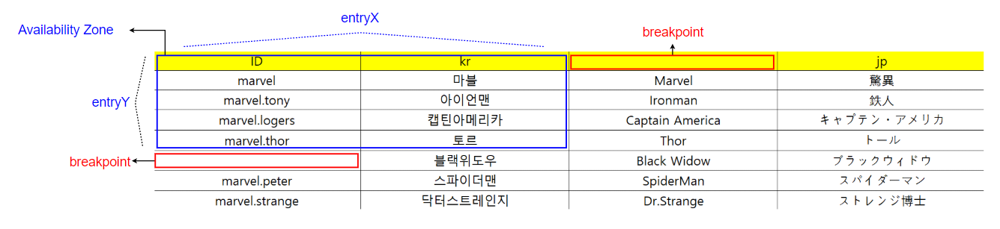
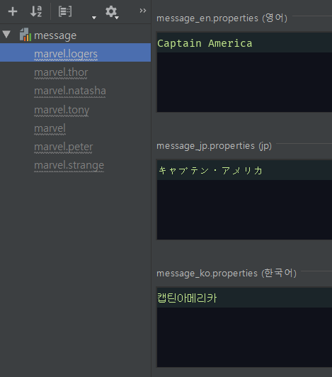

# Multilingual Excel Convert

###### Java Tutorial Proeject

다국어 통합 및 다국어 자동화를  관리하기 위한 자바 애플리케이션입니다.
운영 및 번역팀은 통합 엑셀파일을 관리하고 각각의 엑셀파일의 배포는 자바 애플리케이션을 통하여 이루어 집니다.


## 인프라구성

- 새로운 다국어 프로젝트가 추가 될 경우 Developer는 manifest.json 파일에 새로운 파일의 구성정보를 추가합니다.
- Console을 통해 (필요에 따라 다를 수 있음)으로 Translator에게 번역이 필요한 Excel문서를 전달합니다.
- Translator는 번역작업을 진행하고 Console을 통해 S3 Storage에 번역된 Excel문서를 업로드 합니다.
- S3 Storage에 번역된 Excel문서는 AWS Lambda의 트리거를 동작시킵니다.
- AWS Lambda는 AutoMultilingual.jar 프로그램을 동작시켜 번역된 Excel문서를 manifest.json에 맞게 빌드합니다.
- 빌드된 배포문서는 S3 Storage에 업로드됩니다.
- Developer는 각각 다국어 프로젝트에서 필요에 따라 배포된 문서를 가져다가 활용합니다.




## Excel 규칙



>  정의

- `header` 
  - 테이블의 상단부
- `titles`
  - header내에서 첫번째 cell을 제외한 모든 부분
- `body` 
  - 테이블에서 첫 번째 행을 제외한 하단부
- `keys`
  - body내에서 첫 번째 열
- `values`
  - body내에서 첫 번째 열을 제외한 모든 부분




> 첫 번째 행과 열에서는 빈 문자열을 사용할 수 없습니다.

엑셀문서를 작성할 때 자신이 의도한 부분 이외에 빈문자열이 들어가 빌드과정에서 예외를 발생시킬 수 있습니다.

따라서 첫 번째 행과 열에는 빈 문자열이 있을 경우 종료지점으로 인식하게 됩니다.


## Object 구성

>  `Document`(Excel, CSV, ...) <-> `Resource`(Properties, Json, ...)

- `Document`
  - Excel과 같이 다국어를 작성하는 문서를 지칭하는 오브젝트
- `Resource`
  - Properties와 같이 빌드되어 다국어 자원으로 사용하는 오브젝트
  - 리소스는 다양한 타입을 가질 수 있으나 기본 타입은 `Properties`로 합니다.
    - Document -> Resource(\*.properties) -> Resource(\*.json)


## Manifest 작성방법

Manifest 파일은 구성요소를 미리 정의해두는 파일입니다.

파일위치는 

json 형식을 지원합니다.


> [manifest] Document -> Resource & Resource -> Document 모두 가능합니다.

```json
[
  {
    "importPath" : "src/main/resources/target",
    "exportPath" : "http://s3.nexon.com/deploy",
    "document" : {
      "dir" : "",
      "file" : "excelfile.xlsx",
      "type" : "excel"
    },
    "resource" : {
      "dir" : "projectA",
      "file" : "message",
      "dilimeter" : "_",
      "titles" :  ["en", "kr", "jp"],
      "type": "properties"
    }
  }
]
```

- `importPath`
  - target directory 빌드 대상 자원인 있는 경로
- `exportPath`
  - deploy directory 빌드 완료 자원이 배포되는 경로
- `document`
  - `dir`
    - Document dir 내에 폴더 이름
    - 만약 deploy 시에 폴더 이름이 중복될 경우 `DuplicateDirectoryException` 반환
  - `file`
    - Document dir 내에 파일 이름
    - 만약 Document 폴더 내에 파일이 없다면 `NotFoundFileException` 반환
  - `type`
    - Document 파일 타입
    - excel, csv, ...
- `resource`
  - `dir`	
    - Resource dir 내에 폴더 이름
    - 만약 deploy 시에 폴더 이름이 중복될 경우 `DuplicateDirectoryException` 반환
  - `file`
    - Resource 파일 이름의 접두어
    - 만약 Resource 폴더 내에 파일이 없다면 `NotFoundFileException반환
  - `dilimeter`
    - Resource 파일의 구분자 ( _ 권장)
  - `titles`
    - Resource 파일의 종류
    - 만약 없을 경우 엑셀이 첫번째 행부분이 배포파일의 종류로 설정
    - kr, en, jp, ...
  - `type`
    - Resource 파일 타입
    - properties, json, ...


## JSON 타입 이슈

현재까지 확인한 바로는 `*.properties`  파일을 완벽히 `*.json`으로 표현할 수 있는 것은 아닙니다.

아래의 예제를 확인해 봅시다.

> .properties 파일

```properties
marvel=마블
marvel.tony=아이언맨
marvel.logers=캡틴아메리카
```

> .json 파일

```json
{
	"marvel" : {
        "tony" : "아이언맨",
        "logers" : "캡틴아메리카"
	}
}
```

`.properties` 파일은 하위그룹을 묶어주는 상위그룹에 값을 지정할 수 있으나

`.json` 파일은 하위그룹이 있다면 객체로 표현되기 때문에 상위 그룹에 값을 지정할 수 없습니다.

> 따라서 .properties -> .json으로 호환하는 방식은 완전하지 않습니다.


## 결과

프로젝트 빌드후에 확인한 결과값입니다.




## TODO

- AWS Lambda 프로세스 연동
- AWS S3 Storage 연동
- 알림프로세스 - 빌드동작여부를 Developer에게 전달 ( slack, mail, ... )
- Exception 상세화
- TestCode 적용
- 로그 수집 연동