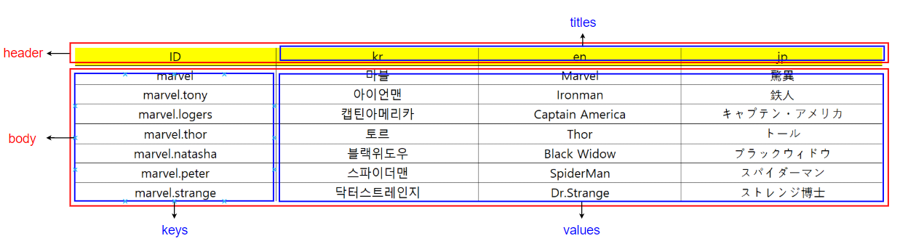

# Multilingual Excel Convert

###### Java Tutorial Proeject

다국어 통합 및 다국어 자동화를  관리하기 위한 자바 애플리케이션입니다.
운영 및 번역팀은 통합 엑셀파일을 관리하고 각각의 엑셀파일의 배포는 자바 애플리케이션을 통하여 이루어 집니다.


## 인프라구성

- 새로운 다국어 프로젝트가 추가 될 경우 Developer는 manifest.json 파일에 새로운 파일의 구성정보를 추가합니다.
- Console을 통해 (필요에 따라 다를 수 있음)으로 Translator에게 번역이 필요한 Excel문서를 전달합니다.
- Translator는 번역작업을 진행하고 Console을 통해 S3 Storage에 번역된 Excel문서를 업로드 합니다.
- S3 Storage에 번역된 Excel문서는 AWS Lambda의 트리거를 동작시킵니다.
- AWS Lambda는 AutoMultilingual.jar 프로그램을 동작시켜 번역된 Excel문서를 manifest.json에 맞게 빌드합니다.
- 빌드된 배포문서는 S3 Storage에 업로드됩니다.
- Developer는 각각 다국어 프로젝트에서 필요에 따라 배포된 문서를 가져다가 활용합니다.


## Excel 규칙



>  정의

- `header` 
  - 테이블의 상단부
- `titles`
  - header내에서 첫번째 cell을 제외한 모든 부분
- `body` 
  - 테이블에서 첫 번째 행을 제외한 하단부
- `keys`
  - body내에서 첫 번째 열
- `values`
  - body내에서 첫 번째 열을 제외한 모든 부분


> 첫 번째 행과 열에서는 빈 문자열을 사용할 수 없습니다.

엑셀문서를 작성할 때 자신이 의도한 부분 이외에 빈문자열이 들어가 빌드과정에서 예외를 발생시킬 수 있습니다.

따라서 첫 번째 행과 열에는 빈 문자열이 있을 경우 종료지점으로 인식하게 됩니다.


## Manifest 작성방법

```json
[
  {
    "deployPath" : "deploy_path",
    "excelName" : "excel.xlsx",
    "dirName" : "mydir",
    "filePrefix": "message",
    "dilimeter": "_",
    "titles": ["en", "kr", "jp"],
    "type": "properties"
  }
]
```

- `deployPath`
  - 배포되야하는 경로, 또는 방식
- `excelName`
  - target 폴더내에 excel 파일 이름
  - 만약 target 폴더내에 excel 파일 이름이 없다면 `NotFoundExcelFileException` 반환
- `dirName`
  - deploy 폴더내에 배포 폴더 이름
  - 만약 deploy 폴더이름이 중복될 경우 `DuplicateDirectoryException` 반환
- `filePrefix`
  - 배포파일의 접두어
- `dilimeter`
  - 배포파일의 구분자 ( _ 권장)
- `titles`
  - 배포파일의 종류
  - 만약 없을 경우 엑셀이 첫번째 행부분이 배포파일의 종류로 설정
  - kr, en, jp, ...
- `type`
  - 배포파일 타입
  - properties, json, ...


## Resource 파일

> resource/target/

빌드가 필요한 *.xlxs 파일을 저장하는 곳입니다.

manifest.json 설정값에 따라 AWS S3 Storage에서 *.xlxs 파일을 가져올 수도 있습니다.


> resource/deploy/

빌드된 번역파일을 저장하는 곳입니다.

manifest.json 설정값에 따라 AWS S3 Storage로 파일을 배포할 수도 있습니다.


## API

>  `Document`(Excel, CSV, ...) <-> `Resource`(Properties, Json, ...)

- `Document`
  - Excel과 같이 다국어를 작성하는 문서를 지칭하는 오브젝트
- `Resource`
  - Properties와 같이 빌드되어 다국어 자원으로 사용하는 오브젝트
  - 리소스는 다양한 타입을 가질 수 있으나 기본 타입은 `Properties`로 합니다.
    - Document -> Resource(\*.properties) -> Resource(\*.json)


## TODO

- AWS Lambda 프로세스 연동
- AWS S3 Storage 연동
- 알림프로세스 - 빌드동작여부를 Developer에게 전달 ( slack, mail, ... )
- Exception 상세화
- TestCode 적용
- 로그 수집 연동